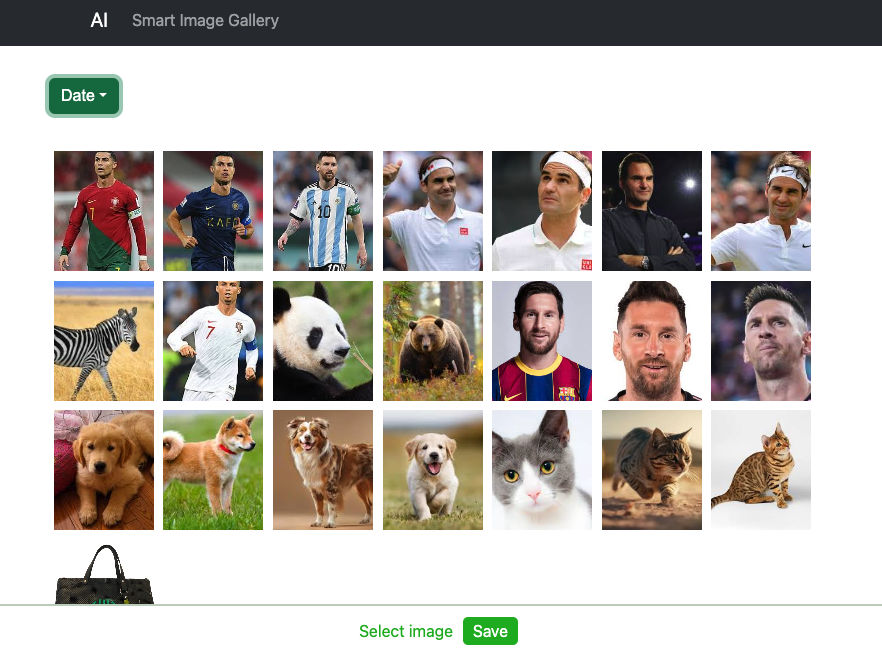
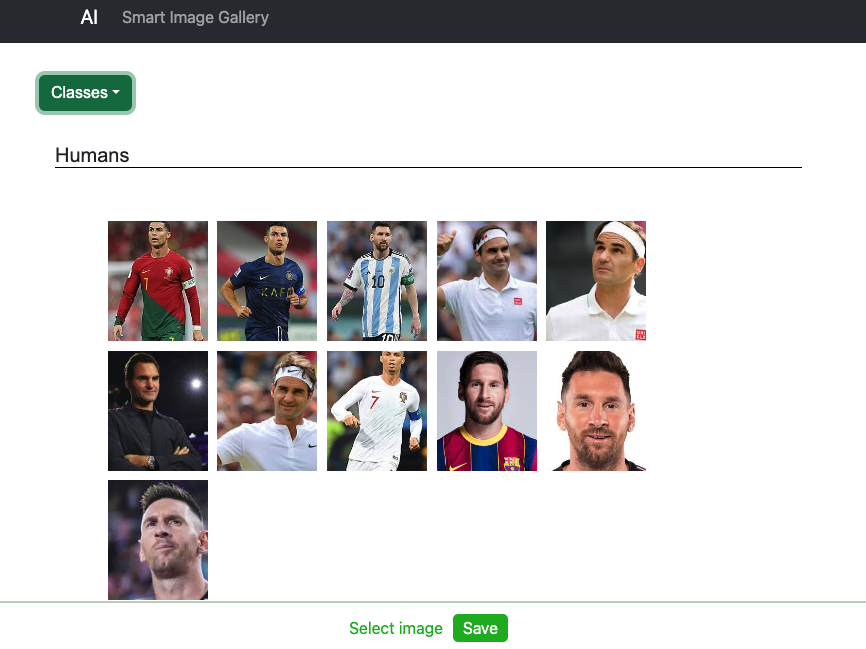
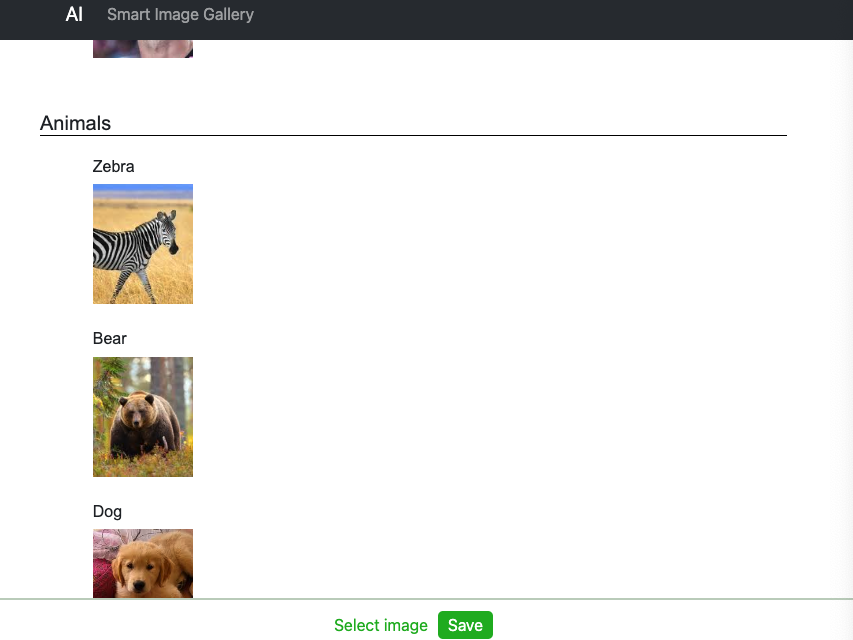
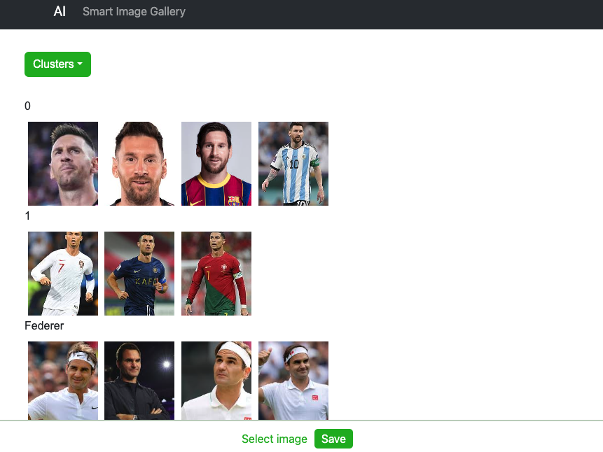

# AI Gallery project

## Features:

- A web app that allows users to upload and process image files.
- The app processes the images and detects humans.
- The app detects animals in images.
- The app clusters and identifies humans and animals
- There is the possibility of tagging or adding custom labels to images for better organization.
- It is possible to filter images by humans in them.
- It is possible to filter images by types of animals in them.

## Results

<!--  -->

### Date sorted

    

### Classes

    

    

### Clusters of detected faces

    

<!--  -->
<!--  -->
<!--  -->
